<picture>
  <source media="(prefers-color-scheme: dark)" srcset="banner.svg?v=1">
  <source media="(prefers-color-scheme: light)" srcset="banner-light.svg?v=1">
  
</picture>

   

---

## What I’m Building

| Project | Stack | Live Demo |
|---|---|---|
| [MUSE Students Voice](https://github.com/Abhirai2006/MUSE-Students-Voice) | TanStack Start · React 19 · Supabase · Cloudflare Workers | [Open ↗](https://muse-studentsvoice.lovable.app/) |
| [O(patience) — Sorting Visualizer](https://github.com/Abhirai2006/sorting-visualizer) | TypeScript · React | [Open ↗](https://sort-visually-abhirai2006.lovable.app/) |
| [Binary Search Visualizer](https://github.com/Abhirai2006/Binary_Search) | HTML · CSS · JavaScript | [Open ↗](https://binarysearch-abhirai.netlify.app/) |
| [Portfolio v3 / Arthra](https://github.com/Abhirai2006/Portfolio-v3) | TanStack Start · React 19 · Three.js · Tailwind CSS v4 | [Open ↗](https://portfolio-abhirai2006.lovable.app/) |
| [daily-code](https://github.com/Abhirai2006/daily-code) *(ongoing)* | Python · DSA | — |

### MUSE Students Voice → [Live Demo ↗](https://muse-studentsvoice.lovable.app/)

*Speak up. Anonymously. Together.*

An anonymous, quorum-verified grievance platform for my campus. Every complaint is voted True or False by fellow students, and the ones that clear quorum get auto-compiled into a formal PDF letter addressed to the Director and Vice Chancellor.

- **USN-gated signup** — one account per student, checked against a seeded registry of 1,159+ real USNs across five departments.
- **Anonymous by design** — a USN proves that a person is a real student but never appears on posts, votes, or comments.
- **True/False consensus voting** with a live quorum bar, so only complaints the campus agrees on get escalated.
- **One-click PDF escalation letters** with a ready-to-send email body for administrators.
- **Row-Level Security everywhere** — public reads go through sanitized Postgres views, and author identity never leaks.
- **Edge-rendered delivery** on Cloudflare Workers with TanStack Start, React 19, and Supabase.

### O(patience) — Sorting Algorithm Playground → [Live Demo ↗](https://sort-visually-abhirai2006.lovable.app/)

*Visualize. Compare. Understand.*

A deeply interactive sorting visualizer that turns pseudocode into something you can see, race, and quiz yourself on.

- **Visualizer** — Bubble, Selection, Insertion, Merge, and Quick Sort with live pointer flags, sound mode, completion feedback, and step-by-step export.
- **Race mode** — all five algorithms on the same input with a leaderboard and race history.
- **Quiz mode** — a three-tier “Name That Sort” game with animation recognition, trace snapshots, and pseudocode ordering.
- **Sort DNA** — a session personality engine that assigns types such as *Explorer*, *Speedrunner*, and *Deep Diver*.
- **Embeddable widget** at `/embed` for blog posts and teaching pages.

### Binary Search Visualizer → [Live Demo ↗](https://binarysearch-abhirai.netlify.app/)

A high-performance Binary Search visualizer with glassmorphism UI, real-time low/mid/high tracking, and interactive audio feedback. It makes the `O(log n)` narrowing process visible step by step.

### Portfolio v3 / Arthra → [Live Demo ↗](https://portfolio-abhirai2006.lovable.app/)

*A scroll-driven, 3D-accented personal site, not a template.*

A chapter-based portfolio with live GitHub activity, an interactive “Ask Abhishek” assistant, personal data, and project case studies. **Arthra is the previous Lovable build; the new Playable Signal Lab portfolio is the experimental successor.**

- **Cinematic hero scene** with a Three.js object, mouse-reactive particle field, cursor glow, and portrait reveal.
- **Chapter-based storytelling** across Origin, Power Levels, Live Code, Arsenal, Ask Abhishek, Anime Shelf, and Contact.
- **Live GitHub activity** with public repositories, language breakdown, and a daily contribution heatmap.
- **Interactive project gallery** with case-study panels, terminal previews, magnetic controls, and spotlight hover states.
- **Ask Abhishek** — an AI assistant concept grounded in resume and project context.
- **Anime Shelf** — an opt-in personal dataset of watched series, episodes, and minutes.
- **Motion system** with dock navigation, magnetic buttons, counters, infinite tracks, border trails, headline reveals, and film grain.

### daily-code → [Repository ↗](https://github.com/Abhirai2006/daily-code)

Daily Python practice documenting the grind from basics to advanced concepts.

`Python` `DSA` `OOP` `Data Structures`

---

## Tech Stack

           

---

## GitHub Stats

  
  

  

---

## Contribution Activity

  

> These values are calculated from GitHub’s daily contribution calendar and updated by the workflow in `.github/workflows/update-contribution-stats.yml`. **Active days** means dates with at least one contribution. **Longest streak** means consecutive active dates; it is not the same as the total number of active days.

<!--START_GITHUB_CONTRIBUTION_STATS-->
| Contribution metric | Current value |
|---|---:|
| Total contributions · last 12 months | Updating daily |
| Active days · last 12 months | Updating daily |
| Current streak | Updating daily |
| Longest streak | Updating daily |
| Peak contributions · one day | Updating daily |

_Last refreshed by GitHub Actions._
<!--END_GITHUB_CONTRIBUTION_STATS-->

---

## Playground & Activity

  <picture>
    <source media="(prefers-color-scheme: dark)" srcset="pacman-contribution-graph-dark.svg">
    <source media="(prefers-color-scheme: light)" srcset="pacman-contribution-graph.svg">
    
  </picture>

  

  

[Portfolio](https://portfolio-abhirai2006.lovable.app/) · [GitHub](https://github.com/Abhirai2006) · [LinkedIn](https://linkedin.com/in/abhishek-rai-a-00067238b) · [Instagram](https://instagram.com/_abhishek.rai.a_)

